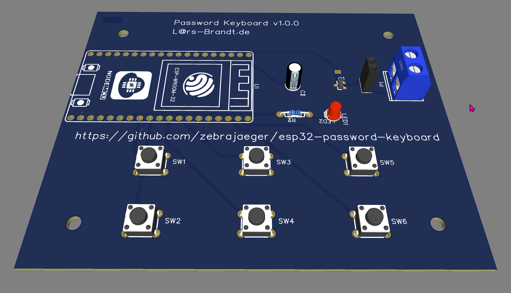

# esp32-password-keyboard

BLE Keyboard with six configurable passwords.

[Schematic](./hardware/Schematic_esp32-password-keyboard_2021-11-09.pdf)

[Hardware on EasyEDA](https://easyeda.com/zebrajaeger/esp32-password-keyboard)

## How to use

- Visual Studio Code
- PlatformIO (ESP32)
- clone this repo
- in platformio.ini change "upload_port = COM3" to your serial port with ESp32 on it
- copy src/config.src.example to src/config.cpp
- change SSID and password in src/config.cpp
- set your password
- compile and upload
